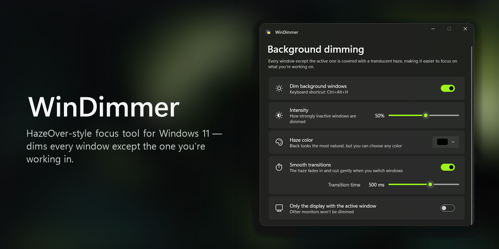
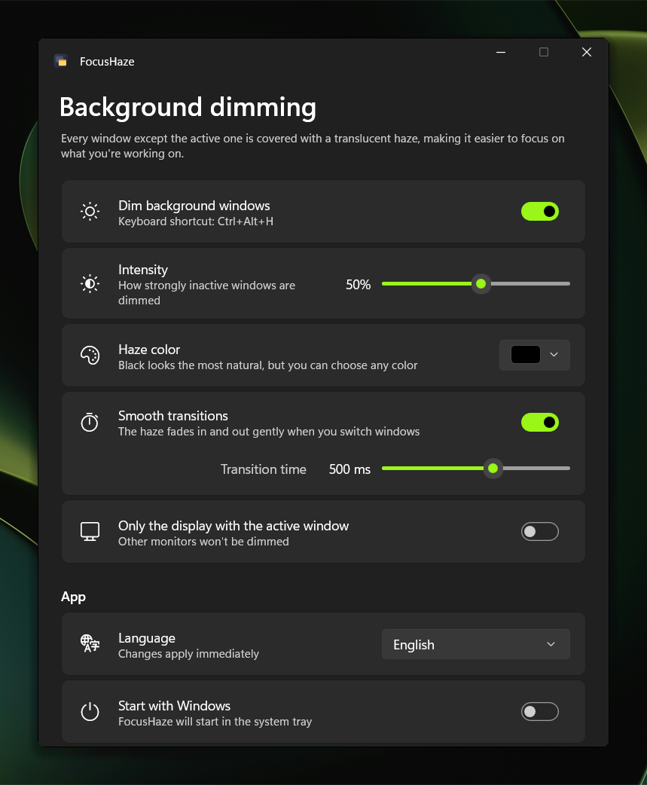

<p align="center">
  
</p>

<p align="center">
  <a href="https://github.com/pietruh00s/WinDimmer/releases/download/v1.0.2/WinDimmer-1.0.2-win-x64.zip"></a>
  &nbsp;
  <a href="https://github.com/pietruh00s/WinDimmer/releases/download/v1.0.2/WinDimmer-1.0.2-win-arm64.zip"></a>
</p>

<p align="center">
  <a href="https://github.com/pietruh00s/WinDimmer/releases/latest"></a>
  <a href="LICENSE"></a>
  <a href="https://buymeacoffee.com/piotrosika"></a>
</p>

<p align="center"><a href="README.md">English</a> | <b>Polski</b></p>

Odpowiednik [HazeOver](https://hazeover.com/) dla Windows 11, napisany w WinUI 3: przyciemnia wszystkie okna poza aktywnym, żeby łatwiej było się skupić.

<p align="center">
  
</p>

## Funkcje

- Półprzezroczysta zasłona pod aktywnym oknem, przepuszczająca kliknięcia
- Regulowana intensywność i kolor zasłony
- Płynne przejścia przy zmianie okna (z regulowanym czasem trwania)
- Przyciemnianie wszystkich monitorów albo tylko tego z aktywnym oknem
- Ikona w zasobniku systemowym: lewy klik otwiera ustawienia, prawy otwiera menu
- Globalny skrót **Ctrl+Alt+H** włącza i wyłącza przyciemnianie
- Opcjonalne uruchamianie razem z Windows (startuje od razu w zasobniku)
- Działa tylko jedna instancja; ponowne uruchomienie otwiera ustawienia działającej aplikacji
- 14 języków interfejsu, przełączanych na żywo: angielski, polski, niemiecki, francuski, hiszpański, włoski, portugalski, niderlandzki, ukraiński, rosyjski, turecki, japoński, koreański i chiński uproszczony. Domyślnie aplikacja używa języka Windows.

## Tłumaczenia

Teksty są w `Localization/Strings.resx` (angielski, język zapasowy) i w `Localization/Strings.<kod>.resx`. Nowy język dodajesz tak:

1. Skopiuj `Strings.resx` jako `Strings.<kod>.resx` (np. `Strings.cs.resx`) i przetłumacz wartości.
2. Dopisz kod języka do `Loc.SupportedLanguages` w `Localization/Loc.cs`.

W XAML tekst podpinasz przez `loc:Localize.Key="NazwaKlucza"`, a w kodzie przez `Loc.Get("NazwaKlucza")`.

## Wymagania

- Windows 10 19041+ / Windows 11
- .NET 10 SDK

## Budowanie i uruchamianie

```bash
dotnet build -c Release
```

```bash
dotnet run
```

Aplikacja jest „unpackaged” i ma dołączony Windows App SDK, więc katalog `bin\Release\net10.0-windows10.0.22621.0\win-x64\` można po prostu skopiować w inne miejsce. Wersję na ARM64 zbudujesz przez `-p:Platform=ARM64`.

Paczki z wydaniem (zip dla x64 i ARM64 oraz plik `SHA256SUMS.txt`) budujesz poleceniem:

```bash
pwsh ./build-release.ps1
```

Gotowe pliki trafią do `artifacts\`. Każdy zip zawiera folder `WinDimmer`, w którym na wierzchu są tylko `WinDimmer.exe` i `LICENSE`. Ten exe to malutki launcher na .NET Framework 4.8 (`Launcher/`, wbudowany w każdy obsługiwany Windows), który uruchamia właściwą aplikację z podfolderu `app\`, gdzie jest cała reszta. Historia zmian jest w [CHANGELOG.md](CHANGELOG.md).

Ustawienia są zapisywane w `%LOCALAPPDATA%\WinDimmer\settings.json`.

## Jak to działa

- `Core/DimOverlay.cs`: natywne okno Win32 (`WS_EX_LAYERED | WS_EX_TRANSPARENT | WS_EX_NOACTIVATE`) wypełnione jednolitym kolorem, z przezroczystością ustawianą przez `SetLayeredWindowAttributes`.
- `Core/DimController.cs`: przez `SetWinEventHook` nasłuchuje zmian okna pierwszoplanowego, minimalizacji, zamknięcia i ukrycia okien, a potem `SetWindowPos` wstawia zasłonę w Z-order **bezpośrednio pod** aktywnym oknem. Wszystko, co leży pod spodem, zostaje przyciemnione. Gdy aktywny jest pulpit, zasłona znika. Pasek zadań, przełącznik Alt+Tab i menu Start są ignorowane.
- `Core/TrayHost.cs`: ukryte okno, które obsługuje ikonę w zasobniku, menu kontekstowe, skrót globalny i sygnał od kolejnej instancji.
- `MainWindow.xaml`: okno ustawień w WinUI 3 (Mica, własny pasek tytułu).

## Wsparcie

Jeśli WinDimmer pomaga Ci się skupić, możesz postawić mi kawę ☕

<a href="https://buymeacoffee.com/piotrosika"></a>

## Licencja

Projekt jest udostępniony na licencji [MIT](LICENSE).

